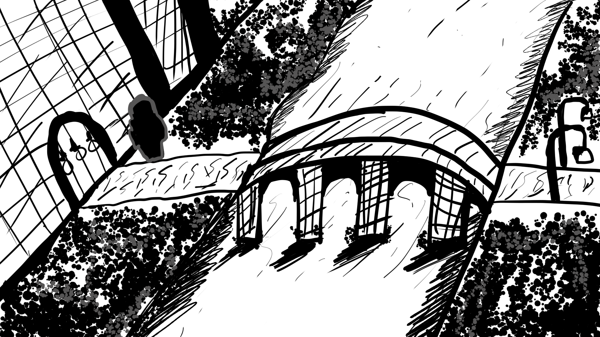

# Castle Journey - Player Guidebook

## Welcome to Castle Journey!

# Castle Journey

You find yourself in a mysterious castle with no memory of how you got here.
Your journey begins in the castle's outer grounds, and you must explore to uncover the secrets of this ancient place.

## Getting Started

### Basic Controls

- **Mouse**: Navigate and interact with objects
- **E or I**: Open your inventory
  

- **ESC**: Open the game menu
- **Navigation**: Click yellow circles in the screen to move around or interact with items
  

### Your Goal

Your main objective is to reach the Castle City and discover the truth about your past.
Along the way, you'll meet interesting characters, complete quests, and gather equipment to help you on your journey.

## The Item Shop

### How to Access

1. Reach Castle City
2. Look for the item shop button
3. Click to enter the shop

### How to Buy Items

1. **Browse**: Look at the items in the shop grid
2. **Select**: Single-click an item to highlight it (white outline appears)
3. **Purchase**: Double-click the highlighted item to buy it
4. **Auto-Equip**: Items automatically go to the correct equipment slot

### Shopping Tips

- **Check your gold**: The shop shows your current gold amount
- **Start with free items**: The stick is free and useful
- **Save for armor**: Armor provides good protection
- **Visual feedback**: Green messages mean success, red means not enough gold

## Your Inventory

### Equipment Slots

Your character has five equipment slots:

- **Helmet**: Protects your head
- **Armor**: Protects your body
- **Hands**: Protects your hands
- **Leggings**: Protects your legs
- **Weapon**: Your combat equipment

### How to Use

- **Open Inventory**: Press E or I
- **View Equipment**: See your equipped items in the left panel
- **View Items**: See collected items in the main grid
- **Auto-Equipment**: Items automatically equip when you buy them

## Quests and Rewards

Go around the city for quests, quests will give you coins for reward.

## Tips for Success

### Exploration

- **Look carefully**: Navigation buttons can be hidden in the scenery
- **Talk to everyone**: NPCs provide important information and quests
- **Take your time**: Don't rush - the castle has many secrets

### Combat and Equipment

- **Start with the stick**: It's free and better than nothing
- **Save your gold**: Don't spend everything at once
- **Prioritize armor**: Protection is valuable in this castle
- **Check your inventory**: Make sure items are properly equipped

### Navigation

- **Follow the path**: Each level leads to the next
- **Look for buttons**: Navigation buttons are usually visible
- **Don't get lost**: The castle is designed to guide you forward

## Troubleshooting

### Common Issues

- **Can't find navigation**: Look carefully around the edges of the screen
- **Not enough gold**: Complete quests to earn more gold
- **Items not equipping**: Check your inventory (E or I key)
- **Shop not working**: Make sure you're in Level 6

### Getting Help

- **Check this guide**: Most answers are here
- **Explore thoroughly**: The solution is usually nearby
- **Talk to NPCs**: They often provide hints

## The Castle's Story

### What You Know

- You woke up in this castle with no memory
- The place feels strangely familiar
- There's a mystery about a guardian
- The castle has been through troubled times

### What to Discover

- Your true identity
- The castle's history
- The role of the guardian
- The source of the darkness

## Credits

Castle Journey is an adventure game that rewards exploration and careful thinking. Take your time, enjoy the atmosphere, and uncover the secrets of this mysterious castle!

---

**Good luck on your journey, brave adventurer!**
